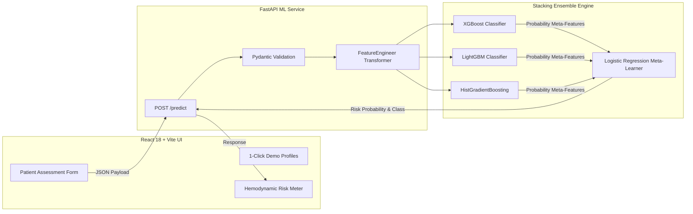

# CardioGuard AI — Intelligent Cardiovascular Risk Stratification

[](https://www.python.org/)
[](https://fastapi.tiangolo.com/)
[](https://react.dev/)
[](https://vitejs.dev/)
[](https://scikit-learn.org/)
[](https://xgboost.ai/)
[](https://lightgbm.readthedocs.io/)

An end-to-end clinical machine learning system for predicting 10-year cardiovascular disease risk using physiological biomarkers, hemodynamics, and lifestyle factors. Powered by a multi-stage **Stacking Classifier Ensemble** achieving an **0.8048 ROC-AUC** and served via an asynchronous **FastAPI** backend and responsive **React 18 + Vite** dashboard.

---

## 🌟 Key Highlights

- **Heterogeneous Stacking Ensemble:** Blends predictions from **XGBoost**, **LightGBM**, and **HistGradientBoosting** using a regularized **Logistic Regression** meta-model.
- **Leakage-Free Feature Pipeline:** Custom `FeatureEngineer` Transformer derives Mean Arterial Pressure (MAP), Pulse Pressure (PP), Blood Pressure ratios, interaction terms, and log transformations inside the Pipeline.
- **Validated on 68,640 Records:** Filtered from 70,000 raw patient records using physiological outlier boundaries.
- **FastAPI Asynchronous Inference:** Sub-50ms inference latency, Pydantic type validation, CORS security, and automated Swagger documentation at `/docs`.
- **Modern Clinical Dashboard:** Real-time client-side BMI calculations, interactive 1-click patient profile presets (Healthy, Moderate, High Risk), and animated hemodynamic risk gauges.
- **Evaluation Defense Report:** Includes a formal project documentation PDF ([`CardioGuard_AI_Project_Report.pdf`](./CardioGuard_AI_Project_Report.pdf)) with academic viva Q&A and methodology explanations.

---

## 📊 Model Performance Benchmarks

Evaluated with **Repeated Stratified 5-Fold Cross-Validation** (3 splits, 2 repeats):

| Model Name | Algorithm Type | CV Mean Accuracy | Test Accuracy | Test ROC-AUC | F1 Score | Status |
| :--- | :--- | :---: | :---: | :---: | :---: | :--- |
| **Stacking Ensemble** | **XGB + LGBM + HGB + LR Meta** | **73.53% ±0.26%** | **73.20%** | **0.8048** | **0.7165** | **Active Production** |
| HistGradientBoosting | Binned Tree Gradient Boost | 73.56% ±0.23% | 73.15% | 0.7999 | 0.7151 | Base Estimator |
| XGBoost | Regularized Tree Ensemble | 73.50% ±0.27% | 73.08% | 0.7991 | 0.7145 | Base Estimator |
| LightGBM | Leaf-wise Tree Boosting | 73.50% ±0.31% | 73.09% | 0.7991 | 0.7147 | Base Estimator |
| Decision Tree | Interpretable Tree (depth=5) | — | 73.11% | 0.7919 | 0.7134 | Baseline Benchmark |
| Logistic Regression (Sklearn) | L2 Generalized Linear Model | — | 72.67% | 0.7935 | 0.7070 | Meta-Model Layer |
| Logistic Regression (Scratch) | Custom Gradient Descent (NumPy) | — | 72.70% | 0.7920 | 0.7065 | Algorithm Validation |

---

## 🏗️ System Architecture



---

## 🚀 Getting Started

### Prerequisites
- **Python 3.11+**
- **Node.js 18+** & **npm**

---

### 1. Setup & Run the Backend (FastAPI ML Service)

```bash
# Navigate to ml-service directory
cd ml-service

# Create virtual environment & install dependencies
python -m venv .venv
# On Windows:
.\.venv\Scripts\pip install -r requirements.txt
# On Linux/macOS:
# source .venv/bin/activate && pip install -r requirements.txt

# Start the ML API server
.\.venv\Scripts\uvicorn api.app:app --reload --host 0.0.0.0 --port 8000
```

- **Health Check:** [http://127.0.0.1:8000/health](http://127.0.0.1:8000/health)
- **Interactive Swagger Docs:** [http://127.0.0.1:8000/docs](http://127.0.0.1:8000/docs)

---

### 2. Setup & Run the Frontend (React + Vite)

```bash
# Navigate to frontend directory
cd ../frontend

# Install dependencies
npm install

# Start Vite Development Server
npm run dev
```

- **Web Application:** [http://localhost:5173](http://localhost:5173)

---

## 🧪 Automated Testing & Verification

Run the full pytest suite to verify model inference and boundary validation:

```bash
cd ml-service
.\.venv\Scripts\pytest tests/test_api.py -v
```

---

## 📁 Repository Structure

```
ML_Project-main/
├── CardioGuard_AI_Project_Report.pdf   # Complete Project PDF Documentation
├── README.md                           # Project Overview and Documentation
├── .gitignore                          # Git Ignore Configuration
├── frontend/                           # React 18 + Vite Web Application
│   ├── src/
│   │   ├── api/predictionApi.js        # Multi-endpoint resilient fetch client
│   │   ├── components/                 # PredictionForm, PredictionResult, RiskMeter, Navbar
│   │   ├── pages/                      # Home, ModelInfo, About
│   │   ├── App.jsx                     # Root application layout
│   │   ├── index.css                   # Custom Clinical Teal & Royal Indigo theme
│   │   └── main.jsx                    # Entry point
│   ├── package.json
│   └── vite.config.js                  # Vite server & API proxy config
└── ml-service/                         # Python FastAPI & Machine Learning Engine
    ├── api/
    │   ├── app.py                      # FastAPI application routes & CORS
    │   ├── predict.py                  # Dynamic model loading & inference engine
    │   └── utils.py                    # FeatureEngineer TransformerMixin
    ├── dataset/
    │   ├── cardio_train.csv            # Raw dataset (70,000 records)
    │   └── processed/cardio_cleaned.csv# Cleaned dataset (68,640 records)
    ├── models/                         # Serialized models (.joblib & .json)
    ├── tests/
    │   └── test_api.py                 # Automated pytest test cases
    ├── training/
    │   ├── preprocess.py               # Outlier cleaning & feature derivation
    │   ├── train_advanced_models.py    # Stacking ensemble cross-validation trainer
    │   ├── train_decision_tree.py      # Decision tree baseline trainer
    │   ├── train_logistic_regression.py# Sklearn logistic regression trainer
    │   ├── train_logistic_regression_scratch.py # Custom gradient descent algorithm
    │   └── evaluate_models.py          # Model evaluation script
    └── requirements.txt                # Python package dependencies
```

---

## 📜 License & Academic Notice

Developed for educational demonstration and academic coursework. The predictions generated by statistical models are for evaluation purposes and do not constitute formal medical diagnosis.
